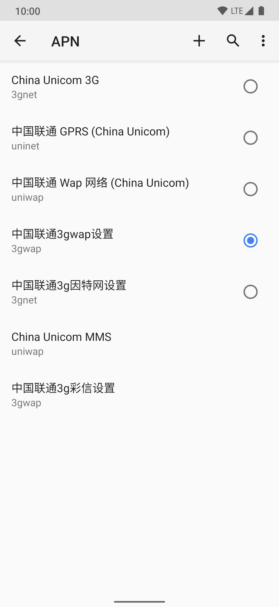
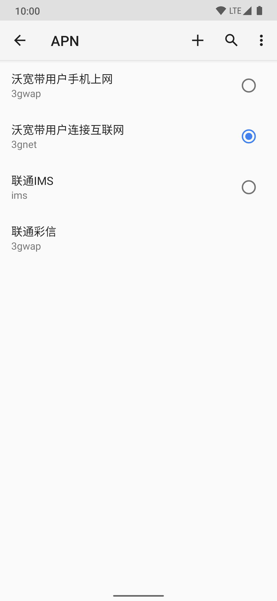

# FixChinaCarrier
[English](https://github.com/RiwiHow/FixChinaCarrier/blob/master/README.md)

简体中文

## Features

- 解决中国运营商网络速度过慢的问题
- systemless 完成文件替换
- 支持多种且灵活的修改方式

## 工作原理

模块通过 Magisk 的 [Magic Mount](https://topjohnwu.github.io/Magisk/details.html#magic-mount)，使用 MIUI 的 `apns-conf.xml` 替换系统的 APN 配置文件。

## 安装要求

- Android 8 及以上且从单独的 APN 配置文件读取 APN 配置的 ROM
- Magisk 20.4 及以上且已安装 Magisk Manager

## 使用方法
从 [releases](https://github.com/RiwiHow/FixChinaCarrier/releases) 下载模块并在 Magisk Manger 安装。

然后在设置的`接入点名称(APN)`选择`重置为默认`。

如下所示：

安装前

安装后

## 问题解决

#### 安装时显示错误 "Upzip error"

请重新下载模块并确认下载过程正常结束。

#### 安装后`/data/adb/modules/fixchinacarrier`目录为空

这可能因为你从旧版本更新到新版本。重新安装模块即可以解决这个问题。

#### 安装报错："ROM 不受支持"

如报错所说，你目前使用的 ROM 不受支持，你可以开一个 issue 详细描述你的问题并提供你的日志，或者提交 pull request 修复这个问题。

## 致谢

* [Magisk](https://github.com/topjohnwu/Magisk) 提供了所需的工具

* [Qingxu](https://github.com/RimuruW) 完成了部分代码工作

* [vvb2060](https://github.com/vvb2060) 和 [落叶凄凉TEL](http://www.coolapk.com/u/2277637) 为模块开发提供了早期指引

* [Zackptg5](https://forum.xda-developers.com/m/zackptg5.6037748/) 提供了模块模板

