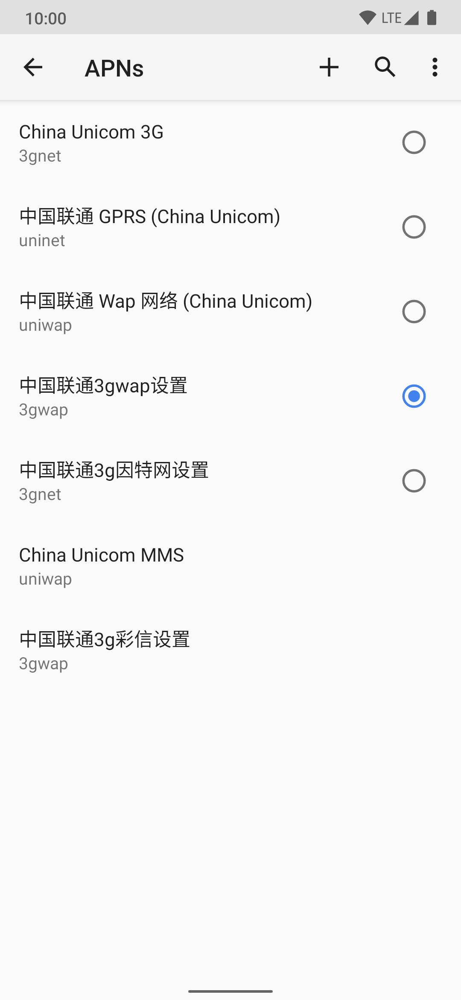
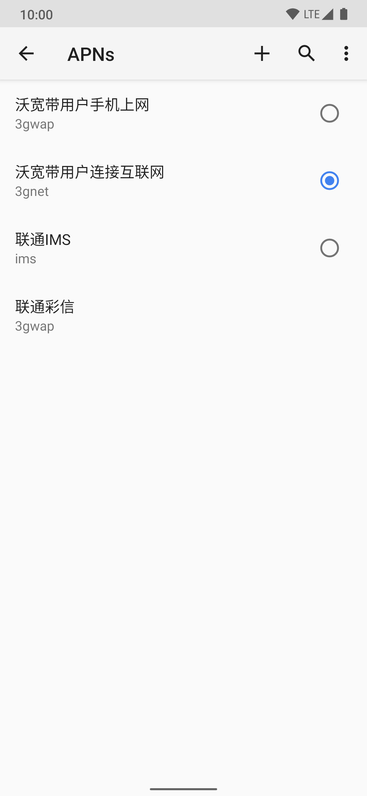

# FixChinaCarrier
English

[简体中文](https://github.com/RiwiHow/FixChinaCarrier/blob/master/Doc/Chinese%20Simplified.md)

## Features

- Solve the low speed of Chinese carriers
- Systemless methods to replace
- Multiple flexible modifications support

## How it works?

The module replaces the system's original `apns-conf.xml` by MIUI's via Magisk's [Magic Mount](https://topjohnwu.github.io/Magisk/details.html#magic-mount).

## Requestents

- Android 8+ and use `apns-conf.xml` as device's APN configuration file.
- Magisk 20.4+ with installed manager

## How to use it?
Download it from [releases](https://github.com/RiwiHow/FixChinaCarrier/releases) and the install it in Magisk Manager.

After that, go to `Access Point Names (APN)` settings to `Reset to default` manually.

Example as blow:

Before using

After using

## Troubleshooting

#### Install failed with "Upzip error"

Please download the module again and ensure the download process complete.

#### I install it but there is only a blank directory in `/data/adb/modules/fixchinacarrier`

It might because you upgrade to newer version from the old version. Install it in Magisk Manager again can solve the problem.

#### Install failed! It tells me "The ROM is not supported".

As it said, the ROM you using is not supported by now. You can open a issue with a detailed descriptiona and install log or submit your pull request to slove it. 

## Credits

* [Magisk](https://github.com/topjohnwu/Magisk) provides tools

* [Qingxu](https://github.com/RimuruW) for code works

* [vvb2060](https://github.com/vvb2060) and [落叶凄凉TEL](http://www.coolapk.com/u/2277637) provide guidances for us

* [Zackptg5](https://forum.xda-developers.com/m/zackptg5.6037748/) provide the Magisk module template

